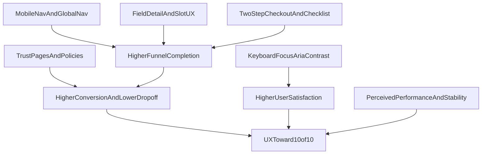

# Lộ trình UX/UI 10/10 cho ĐặtSân.vn

## Mục tiêu định lượng (Definition of Done)

- Tăng tỷ lệ hoàn tất funnel `fields/detail -> checkout -> confirmation` ít nhất 20-30%.
- Giảm tỷ lệ rời trang ở `checkout` ít nhất 25%.
- Mobile usability đạt mức ổn định: không có điểm nghẽn điều hướng chính.
- Accessibility đạt baseline tốt (keyboard, focus, semantic labels, color contrast quan trọng).
- Core Web Vitals không có điểm đỏ ở các trang chính.

## Giai đoạn 1 - Foundation (1-2 tuần)

### 1) Chuẩn hóa điều hướng toàn site

- Thêm mobile navigation (hamburger + drawer) và trạng thái active rõ ở [Web-design-final/views/layouts/main.ejs](Web-design-final/views/layouts/main.ejs).
- Đồng nhất nav text/CTA theo cùng một ngôn ngữ (VN hoặc EN, ưu tiên VN toàn phần).
- Thay toàn bộ link placeholder `#` bằng trang thật hoặc ẩn tạm nếu chưa sẵn sàng nội dung.

### 2) Chuẩn hóa token giao diện và typographic scale

- Gom màu/spacing/radius/shadow vào một bộ token dùng chung cho layout chính, auth, admin, owner:
  - [Web-design-final/views/layouts/main.ejs](Web-design-final/views/layouts/main.ejs)
  - [Web-design-final/views/layouts/admin.ejs](Web-design-final/views/layouts/admin.ejs)
  - [Web-design-final/views/layouts/owner.ejs](Web-design-final/views/layouts/owner.ejs)
  - [Web-design-final/views/auth/login.ejs](Web-design-final/views/auth/login.ejs)
  - [Web-design-final/views/auth/register.ejs](Web-design-final/views/auth/register.ejs)
- Kết quả cần đạt: nhìn đồng nhất giữa user-side và portal-side, giảm cảm giác “nhiều sản phẩm ghép lại”.

### 3) Thiết lập chuẩn đo lường hành vi

- Định nghĩa event tracking cho các điểm chính:
  - Search submit, filter click, slot select, checkout enter, payment submit, confirmation view.
- Gắn event ở các file hành vi:
  - [Web-design-final/public/js/timeslot.js](Web-design-final/public/js/timeslot.js)
  - [Web-design-final/views/bookings/checkout.ejs](Web-design-final/views/bookings/checkout.ejs)
  - [Web-design-final/views/home/index.ejs](Web-design-final/views/home/index.ejs)

## Giai đoạn 2 - Tối ưu funnel đặt sân (2-3 tuần)

### 1) Rút ma sát ở trang chi tiết sân

- Tái cấu trúc [Web-design-final/views/fields/detail.ejs](Web-design-final/views/fields/detail.ejs):
  - Nhấn mạnh 1 CTA chính: chọn ngày -> chọn giờ -> tiếp tục.
  - Giảm thông tin phụ phía trên fold trên mobile.
  - Hiển thị thông tin “còn bao nhiêu slot trống hôm nay” để thúc đẩy quyết định.
- Cải tiến trạng thái loading/error/no-slots nhất quán trong [Web-design-final/public/js/timeslot.js](Web-design-final/public/js/timeslot.js).

### 2) Checkout thành flow rõ ràng 2 bước

- Tách rõ visual thành:
  - Bước 1: thông tin chuyển khoản + copy nhanh.
  - Bước 2: upload bill + xác nhận.
- Áp dụng trên [Web-design-final/views/bookings/checkout.ejs](Web-design-final/views/bookings/checkout.ejs) với sticky summary ngắn gọn.
- Thêm checklist trước submit: số tiền, nội dung CK, ảnh bill hợp lệ.

### 3) Tăng độ chắc chắn sau submit

- Ở [Web-design-final/views/bookings/confirmation.ejs](Web-design-final/views/bookings/confirmation.ejs), thêm:
  - timeline “đã nhận -> đang duyệt -> xác nhận/từ chối”,
  - thời gian duyệt dự kiến,
  - hành động tiếp theo rõ (xem lịch sử, liên hệ hỗ trợ).

## Giai đoạn 3 - Trust & Content UX (1-2 tuần)

### 1) Củng cố niềm tin mua hàng

- Bổ sung trang thật cho Điều khoản/Bảo mật/Liên hệ từ footer [Web-design-final/views/layouts/main.ejs](Web-design-final/views/layouts/main.ejs).
- Làm rõ chính sách hủy/đổi lịch ở checkout và confirmation.
- Chuyển testimonial từ tĩnh sang dữ liệu có kiểm chứng (hoặc gắn nhãn “ví dụ”).

### 2) Nâng chất lượng thông tin sân

- Ở [Web-design-final/views/fields/list.ejs](Web-design-final/views/fields/list.ejs) và [Web-design-final/views/fields/detail.ejs](Web-design-final/views/fields/detail.ejs):
  - ưu tiên thông tin quyết định nhanh: vị trí, giá, tiện ích nổi bật, tình trạng khả dụng.
  - thêm “badge minh bạch” cho sân đã xác thực.

## Giai đoạn 4 - Accessibility & Mobile Excellence (2 tuần)

### 1) Keyboard + semantic + focus

- Chuẩn hóa component tương tác custom (calendar, slot cards, icon buttons):
  - thêm `aria-label`, `role`, `tabindex`, hỗ trợ `Enter/Space`.
- Tập trung file:
  - [Web-design-final/views/fields/detail.ejs](Web-design-final/views/fields/detail.ejs)
  - [Web-design-final/public/js/timeslot.js](Web-design-final/public/js/timeslot.js)
  - [Web-design-final/views/bookings/checkout.ejs](Web-design-final/views/bookings/checkout.ejs)

### 2) Color contrast + trạng thái rõ

- Soát lại text/xám nhạt trên nền sáng, badge trạng thái, nút disabled ở mọi layout.
- Bổ sung focus ring nhất quán cho tất cả input/button/link.

### 3) Responsive quality pass

- Kiểm tra breakpoints trọng yếu: 375px, 390px, 768px, 1024px.
- Ưu tiên trang:
  - home, fields list/detail, checkout, auth login/register, booking history.

## Giai đoạn 5 - Hiệu năng & ổn định nhận thức (1 tuần)

### 1) Giảm tải cảm giác nặng trang

- Tối ưu ảnh hero/gallery (kích thước, lazy-load hợp lý).
- Giảm animation không cần thiết trên mobile/thiết bị yếu.
- Hạn chế script inline lớn trong view, tách logic sang file `public/js` để dễ quản trị.

### 2) Cải thiện perceived performance

- Skeleton/loading đồng nhất cho list, slot, checkout actions.
- Tránh layout shift ở section ảnh/thẻ sân.

## Giai đoạn 6 - Vận hành theo dữ liệu (liên tục)

### 1) A/B test ưu tiên

- Test biến thể CTA ở `fields/detail` (màu, label, vị trí).
- Test checkout copywriting (ngắn gọn vs chi tiết) tại [Web-design-final/views/bookings/checkout.ejs](Web-design-final/views/bookings/checkout.ejs).
- Test trình tự hiển thị dịch vụ đi kèm (trước/sau upload bill).

### 2) UX dashboard theo tuần

- Theo dõi:
  - CTR từ list -> detail,
  - slot selection rate,
  - checkout submit success,
  - approval turnaround time,
  - mobile drop-off.
- Mỗi tuần chọn 1 bottleneck lớn nhất để xử lý theo vòng lặp: `đo -> sửa -> đo lại`.

## Lộ trình triển khai theo sprint

- Sprint 1: Foundation + Mobile nav + Tracking cơ bản.
- Sprint 2: Detail page + Timeslot UX + Checkout bước hóa.
- Sprint 3: Trust pages + Confirmation timeline + Accessibility baseline.
- Sprint 4: Performance pass + A/B test + dashboard vận hành.

## Sơ đồ ưu tiên tác động

## Rủi ro chính và cách giảm thiểu

- Scope quá rộng: chốt KPI theo sprint, tránh làm đồng thời mọi thứ.
- Design drift giữa các layout: dùng token + checklist review UI trước merge.
- Sửa UX nhưng không đo được hiệu quả: bắt buộc có baseline metrics trước khi thay đổi lớn.

## Kết quả kỳ vọng sau 6-8 tuần

- Trải nghiệm nhất quán giữa mọi khu vực user/admin/owner.
- Funnel đặt sân mượt hơn, ít bỏ dở hơn.
- Sản phẩm trông “production-ready” cả về thẩm mỹ lẫn tính dùng được thực tế.
